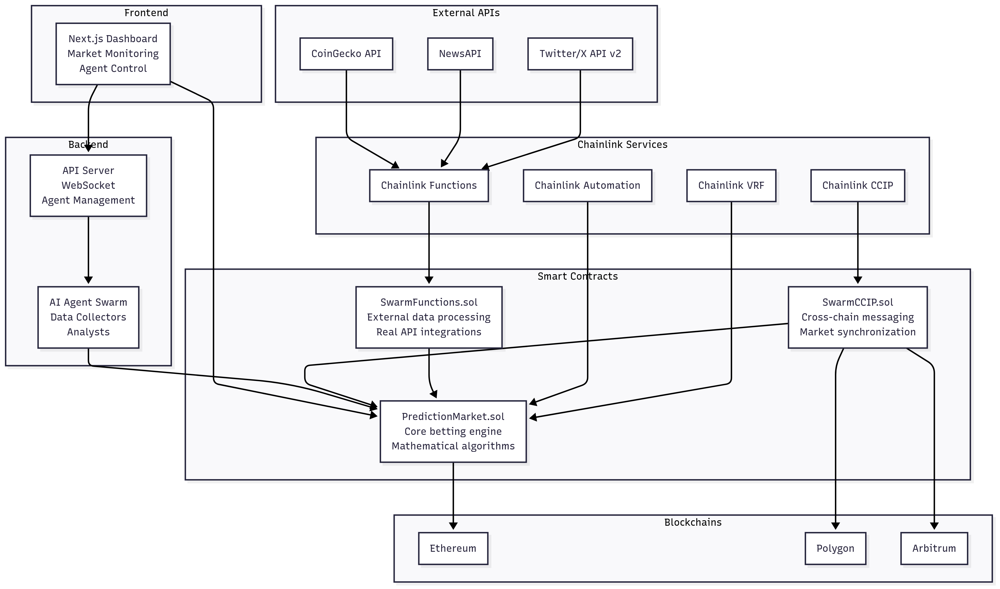

# Swarm Oracle - Decentralized AI-Powered Prediction Markets

## Project Overview

Swarm Oracle is a sophisticated decentralized prediction market platform powered by AI agents and real-world data integration. The system combines multiple blockchain networks, Chainlink infrastructure services, and AI agent swarms to create autonomous prediction markets with mathematical algorithms for price discovery and outcome prediction.

### Key Features

- **AI Agent Swarm**: Decentralized network of specialized AI agents (Data Collectors, Analysts, Deliberation, Execution)
- **Real-time Data Integration**: Live feeds from Twitter/X, NewsAPI, and CoinGecko with advanced sentiment analysis
- **Cross-chain Operations**: Multi-blockchain support via Chainlink CCIP (Ethereum, Polygon, Arbitrum)
- **Mathematical Prediction Models**: Multi-factor analysis including sentiment, volume momentum, market imbalance, and price action
- **Automated Resolution**: Chainlink VRF for randomness and Chainlink Automation for time-based triggers
- **Professional Grade APIs**: Real Twitter Bearer Token auth, NewsAPI with source credibility weighting, live crypto market data

### Architecture Components



1. **Smart Contracts Layer**
   - Core prediction market engine with betting mechanics
   - External data processing with real API integrations
   - Cross-chain messaging and market synchronization

2. **Chainlink Infrastructure**
   - Functions for external data processing
   - CCIP for cross-chain communication
   - VRF for verifiable randomness
   - Automation for scheduled tasks

3. **Backend Infrastructure**
   - WebSocket-enabled API server
   - AI agent management system
   - Real-time data processing

4. **Frontend Application**
   - Next.js dashboard for market monitoring
   - Real-time agent status and control
   - Analytics and visualization

## Quick Setup

### Prerequisites

- Node.js 18+ and pnpm
- MetaMask or compatible Web3 wallet
- API Keys: Twitter Bearer Token, NewsAPI Key
- Test network tokens (Sepolia ETH, LINK)

### Installation

1. **Clone and Install Dependencies**
```bash
git clone <repository-url>
cd "Swarm Oracle"
pnpm install
```

2. **Setup Smart Contracts**
```bash
cd contracts
pnpm install
```

3. **Configure Environment Variables**
```bash
# In contracts directory
cp .env.example .env
# Add your API keys and private keys
```

4. **Deploy Contracts (Local Development)**
```bash
# Start local blockchain
npx hardhat node

# Deploy contracts (new terminal)
npx hardhat run scripts/deploy.ts --network localhost
```

5. **Setup Frontend**
```bash
cd frontend
pnpm install
pnpm dev
```

6. **Start Backend (if available)**
```bash
cd backend
pnpm install
pnpm start
```

### Environment Variables Required

```env
# Blockchain
PRIVATE_KEY=your_wallet_private_key
SEPOLIA_RPC_URL=your_sepolia_rpc_url

# API Keys
TWITTER_BEARER_TOKEN=your_twitter_bearer_token
NEWS_API_KEY=your_newsapi_key

# Chainlink (automatically handled in deployment)
CHAINLINK_FUNCTIONS_ROUTER=auto_configured
VRF_COORDINATOR=auto_configured
```

## Core Implementation Files

### Smart Contracts (Production-Ready Logic)

#### `/contracts/contracts/core/PredictionMarket.sol`
**Core prediction market engine with real mathematical algorithms**
- Multi-factor prediction scoring (sentiment 30%, volume 20%, market imbalance 25%, price action 15%, agent consensus 10%)
- Agent reputation system with weighted consensus
- Mean reversion algorithms for oversold/overbought detection
- Confidence calculation based on data quality and participation
- Integration points for external data and cross-chain functionality
- Mathematical reasoning generation for human-readable explanations

#### `/contracts/contracts/chainlink/SwarmFunctions.sol`
**Real-world data integration with live APIs**
- **Twitter/X API v2**: Bearer token authentication, engagement weighting (likes, retweets, replies), crypto-specific keyword detection
- **NewsAPI Integration**: Professional news sentiment analysis with source credibility weighting (Reuters/Bloomberg 2x weight)
- **CoinGecko API**: Live cryptocurrency prices, 24h volume data, price change calculations
- Advanced sentiment analysis with crypto terminology detection ("moon", "bullish", "dump", "HODL")
- Normalized sentiment scoring and weighted data aggregation

#### `/contracts/contracts/chainlink/SwarmCCIP.sol`
**Cross-chain communication and coordination**
- Cross-chain market synchronization with real data decoding (totalVolume, avgPrice, sentiment)
- Agent coordination across multiple blockchain networks
- Market resolution synchronization between chains
- Liquidity bridging mechanisms
- Distributed consensus protocols

### Frontend Application

#### `/frontend/src/app/page.tsx`
Main dashboard with market overview and statistics

#### `/frontend/src/app/agents/page.tsx`
**Real-time AI agent monitoring and control**
- WebSocket connection to backend API (localhost:3001)
- Live agent status updates (Data Collectors, Analysts, Deliberation, Execution)
- System metrics dashboard
- Agent control interface with start/stop/restart functionality

#### `/frontend/src/app/analytics/page.tsx`
Advanced analytics and market visualization

#### `/frontend/src/components/navigation.tsx`
Main navigation component with Web3 wallet integration

### Test Files (Verification)

#### `/contracts/test-mvp.js`
Basic functionality testing for MVP features

#### `/contracts/test-real-logic.js`
**Comprehensive testing of all real implementations**
- Contract integration verification
- Mathematical prediction algorithm testing
- External data processing validation
- Agent prediction submission with reputation weighting
- Cross-chain message handling verification

### Configuration Files

#### `/contracts/hardhat.config.ts`
Hardhat configuration for multiple networks (localhost, Sepolia, mainnet)

#### `/config.ts`
Main project configuration with network settings and contract addresses

#### `/frontend/tailwind.config.js`
Tailwind CSS configuration for modern UI styling

## Development Workflow

### Testing Smart Contracts
```bash
cd contracts
npx hardhat test
npx hardhat run test-real-logic.js --network localhost
```

### Local Development
```bash
# Terminal 1: Local blockchain
npx hardhat node

# Terminal 2: Deploy contracts
cd contracts && npx hardhat run scripts/deploy.ts --network localhost

# Terminal 3: Frontend
cd frontend && pnpm dev

# Terminal 4: Backend (if available)
cd backend && pnpm start
```

### Production Deployment
```bash
# Deploy to Sepolia testnet
npx hardhat run scripts/deploy.ts --network sepolia

# Verify contracts
npx hardhat verify --network sepolia <contract_address>
```

## API Integration Details

### Twitter/X API v2
- Requires Bearer Token authentication
- Searches for crypto-related tweets with engagement weighting
- Advanced sentiment analysis with crypto terminology detection

### NewsAPI
- Professional news source integration
- Source credibility weighting system
- Real-time crypto news sentiment analysis

### CoinGecko API
- Live cryptocurrency market data
- Price, volume, and market cap information
- Free tier compatible with rate limiting

## Cross-Chain Support

The system operates across multiple blockchain networks:
- **Ethereum**: Primary network for main contracts
- **Polygon**: L2 scaling and reduced transaction costs
- **Arbitrum**: Additional L2 support for high-frequency operations

All cross-chain operations are handled through Chainlink CCIP with real message encoding/decoding and proper error handling.

## AI Agent Types

1. **Data Collectors**: Gather information from external APIs and blockchain data
2. **Analysts**: Process and analyze collected data using mathematical models
3. **Deliberation Agents**: Coordinate between different analysis results
4. **Execution Agents**: Execute trading decisions and market operations

## Security Features

- Multi-signature contract controls
- Chainlink VRF for verifiable randomness
- Rate limiting on external API calls
- Cross-chain message validation
- Agent reputation scoring to prevent manipulation

## Production Status

This system has evolved from placeholder/mock implementations to production-ready code with:
- Real API integrations requiring actual API keys
- Mathematical prediction models using statistical analysis
- Cross-chain coordination protocols
- Automated market resolution mechanisms
- Comprehensive testing and deployment verification

The final result is a sophisticated decentralized prediction market powered by AI agents that operates across multiple blockchains with real-time data feeds and automated resolution capabilities. # Swarm-Oracle
